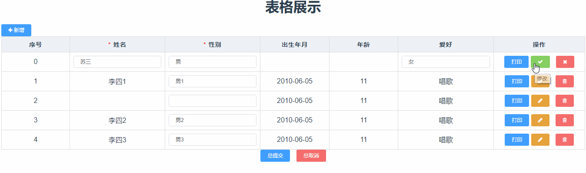

# vue-table-row-edit
---------------------------------------------------

## 当前版本：v2.0.4
[更新日志](https://github.com/Lemonxu/vue-table-row-edit/releases)

------------------------------------------------------------------------------
### Install
```$xslt
npm install vue-table-row-edit --save
```
-------------------------------------------------------------------------------------------
### How to use
```$xslt
import Vue from 'vue'
import App from './App'
import VueTableRowEdit from 'vue-table-row-edit'
import 'vue-table-row-edit/dist/static/vue-table-row-edit.min.css'

Vue.use(ElementUI)
Vue.use(VueTableRowEdit)

new Vue({
  el: '#app',
  template: '<App/>',
  components: { App }
})
```
#### Table Attribute

<table><thead><tr>
<th>参数</th><th>说明</th><th>类型</th><th>可选值</th><th>默认值</th></tr></thead>
<tbody>
<tr><td>data</td><td>显示的数据</td><td>Array</td><td>---</td><td>---</td></tr>
<tr><td>type</td><td>表格类型，add为仅有添加功能</td><td>String</td><td>default/add</td><td>default</td></tr>
<tr><td>rules</td><td>表单验证规则</td><td>Object</td><td>---</td><td>---</td></tr>
<tr><td>add</td><td>是否显示新增按钮</td><td>Boolean</td><td>true/false</td><td>true</td></tr>
<tr><td>addLabel</td><td>新增字样</td><td>String</td><td>---</td><td>新增</td></tr>
<tr><td>operator</td><td>是否有操作列</td><td>Boolean</td><td>true/false</td><td>true</td></tr>
<tr><td>deleteFlag</td><td>是否有删除按钮、事件</td><td>Boolean</td><td>true/false</td><td>true</td></tr>
<tr><td>successFlag</td><td>是否有提交按钮、事件</td><td>Boolean</td><td>true/false</td><td>true</td></tr>
<tr><td>cancelFlag</td><td>是否有取消按钮、事件</td><td>Boolean</td><td>true/false</td><td>true</td></tr>
<tr><td>editFlag</td><td>是否有编辑按钮、事件</td><td>Boolean</td><td>true/false</td><td>true</td></tr>

</tbody></table>

#### Table Events
<table><thead><tr>
<th>事件名</th><th>说明</th><th>回调参数</th></tr>
</thead><tbody>
<tr><td>success</td><td>行内验证提交事件 ,回调(callback(true/false)) (成功)/(失败)</td><td>row,callback</td></tr>
<tr><td>edit</td><td>行内编辑点击事件 ,回调(callback(true/false)) (成功)/(失败)</td><td>row,callback</td></tr>
<tr><td>delete</td><td>行内删除事件 ,回调callback(true/false)(成功)/(失败)</td><td>row,callback</td></tr>
<tr><td>add</td><td>新增事件,回调callback(item),item为新增的行内对象</td><td>callback</td></tr>
<tr><td>validate</td><td>对整个表格的数据进行校验的方法</td><td>this.$refs[data].validate((validateState) => {
                if(validateState){
                  //验证通过
                }
              })</td></tr>
<tr><td>resetFields</td><td>对整个表格的数据进行校验重置</td><td>this.$refs[data].resetFields();</td></tr>
</tbody></table>
<br/>

#### TableColumn Attribute
<table><thead><tr>
<th>参数</th><th>说明</th><th>类型</th><th>可选值</th><th>默认值</th></tr></thead>
<tbody>
<tr><td>type</td><td>当type="operate"则写入到操作列中</td><td>String</td><td>default/operate</td><td>default</td></tr>
<tr><td>prop</td><td>对应列内容的字段名</td><td>String</td><td>---</td><td>---</td></tr>
<tr><td>propType</td><td>对应列内容的字段类型,即行内编辑框的类型</td><td>String</td><td>input/date/number/select</td><td>input</td></tr>
<tr><td>label</td><td>显示的标题</td><td>String</td><td>---</td><td>---</td></tr>
<tr><td>options</td><td>当仅当propType='select'时使用，为下拉框数据</td><td>Array</td><td>---</td><td>---</td></tr>
<tr><td>props</td><td>当仅当propType='select'时使用,</td><td>Object</td><td>label:下拉框显示的字段，String；<br/>value:选择框选择的字段,String；<br/>labelProp:该列下不选择时需要显示的字段,String</td><td>{label:'label',value:'id',labelProp:false}</td></tr>
<tr><td>onlyShow</td><td>当前列是否仅为展示状态</td><td>Boolean</td><td>true/false</td><td>false</td></tr>
<tr><td>clearable</td><td>是否可以清空选项,当propType='number'时无效</td><td>Boolean</td><td>true/false</td><td>false</td></tr>
<tr><td>filterable</td><td>是否可搜索,当propType='select'时有用</td><td>Boolean</td><td>true/false</td><td>false</td></tr>
<tr><td>maxlength</td><td>最长长度</td><td>Number</td><td>---</td><td>50</td></tr>
<tr><td>minlength</td><td>最小长度</td><td>Number</td><td>---</td><td>0</td></tr>
<tr><td>max</td><td>最大值</td><td>Number</td><td>---</td><td>---</td></tr>
<tr><td>min</td><td>最小值</td><td>Number</td><td>---</td><td>---</td></tr>
<tr><td>placeholder</td><td>输入提示</td><td>Number</td><td>---</td><td>---</td></tr>
<tr><td>remote</td><td>远程搜索启动,仅propType="select"可用</td><td>Boolean</td><td>true/false</td><td>false</td></tr>
<tr><td>remoteMethod</td><td>远程搜索方法</td><td>Function</td><td>---</td><td>---</td></tr>
<tr><td>width</td><td>宽度设置</td><td>Number</td><td>---</td><td>80</td></tr>
</tbody></table>

#### TableColumn Events
<table><thead><tr>
<th>事件名</th><th>说明</th><th>回调参数</th></tr>
</thead><tbody>
<tr><td>change</td><td>值改变时触发</td><td>(value,row,item) <br/>value:选中的值，row:该行的数据，item:选择框选中的对象，仅在propType='select'时有值</td></tr>
</tbody></table>

#### Table-column Scoped Slot
<table><thead><tr>
<th>名称</th><th>说明</th></tr>
</thead><tbody>
<tr><td>---</td><td>自定义列的内容，参数为 {row, edit, $index, data}，edit为是否正在编辑中的状态Boolean类型</td></tr>
</tbody></table>


-----------------------------------------------------------------
#### Example
```
<template>
	<xt-table
        :data="data"
        type="edit"
        :rules="rules"
        @success="handleSuccess"
        @delete="handleDelete"
        ref="data">
          <xt-table-column
          prop="name"
          label="姓名"
          propType="input">
          </xt-table-column>
          <xt-table-column
          prop="sex"
          propType="select"
          label="性别"
          :options="selectOptions"
          :props="{label:'name',value:'id',labelProp:'productName'}"
          filterable
          ></xt-table-column>
          <xt-table-column prop="sex"
            label="性别"
            :edit="true"
            propType="input"
            :options="selectOptions">
            <template slot-scope="scope" type="expand">
              <el-input v-model="scope.row.sex" size="mini"></el-input>
              <!--<el-input ></el-input>-->
            </template>
          </xt-table-column>
          <xt-table-column label="操作" type="operate">
              <template slot-scope="scope">
                <el-button size="mini" type="primary" @click="handlePrint(scope.row)">打印</el-button>
              </template>
            </xt-table-column>
      </xt-table>
</template>

<script>
export default {
  name: 'app',
  components: {},
  data () {
    return {
      msg: '表格展示',
      data:[{id:1,name:'苏三',sex:'男',birth:'2003-01-05',hobby:'女',age:21},{id:2,name:'李四',sex:'男',birth:'2010-06-05',hobby:'唱歌',age:11}],
      selectOptions:[{name:'男',value:'男'},{name:'女',value:'女'}]
    }
  },
  methods:{
    handleAdd(callback){
      let item={name:'',sex:'',birth:'',hobby:'',age:0,isEdit:true}
      this.data.push(item);
      callback(item);
    },
    handleClick(row){
      console.log(row)
    },
    handleSuccess(row,callback){
        callback(true)
    },
    handleDelete(row,callback){
      callback(true)
    },
    handlePrint(row) {
      console.log(row, "打印");
    },
  }
</script>
```


